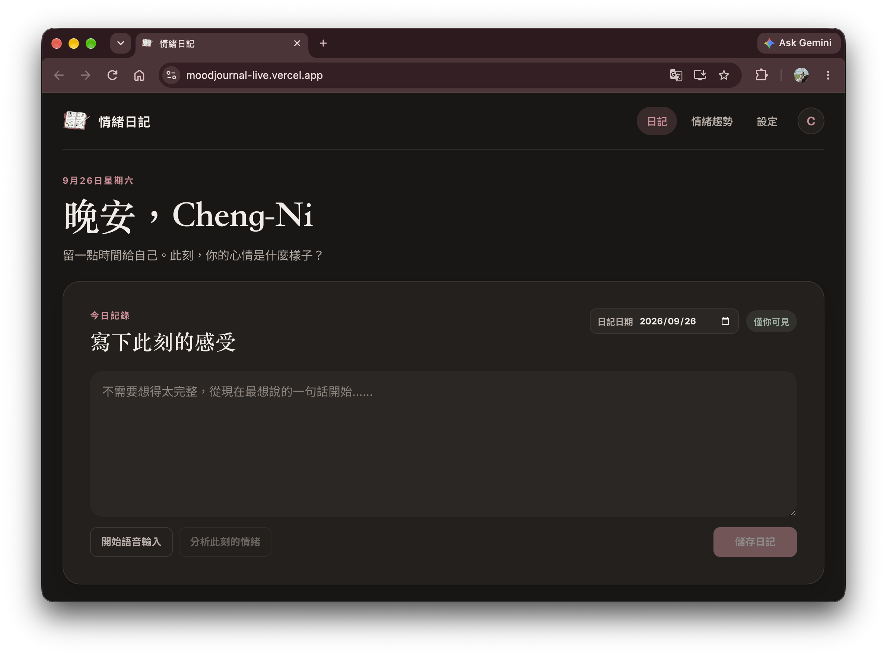
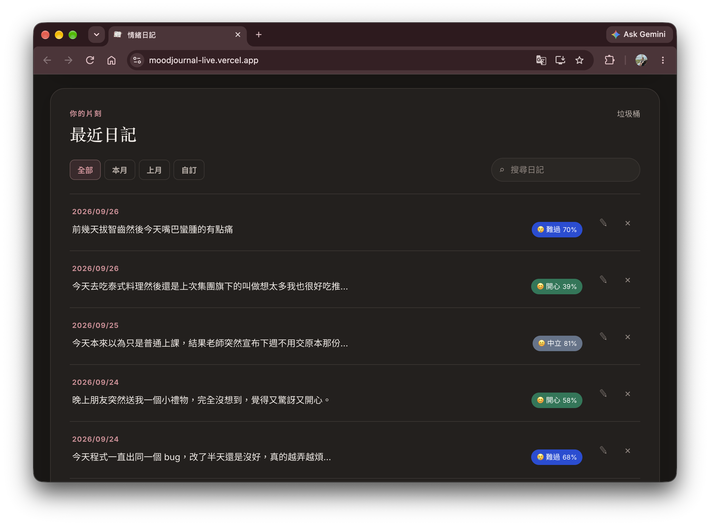
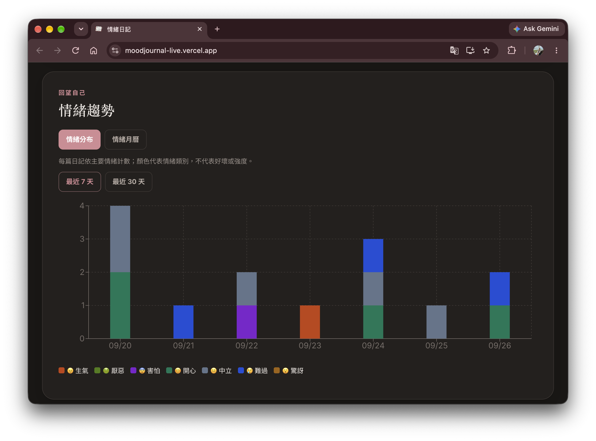

# MoodJournal｜中文多模態情緒日記

MoodJournal 是一個使用 **React + Vite + Firebase** 建置的中文情緒日記 Web App。

使用者可以透過文字或語音記錄日記，並串接獨立的 Machine Learning backend 進行情緒分析。

目前支援七類情緒：

`Anger` · `Disgust` · `Fear` · `Happy` · `Neutral` · `Sad` · `Surprise`

Frontend 已部署於 **Vercel**，backend 則部署於 **Google Cloud Run**。

---

## Live Demo

https://moodjournal-live.vercel.app

> 使用 Google 帳號登入後即可建立日記並使用情緒分析功能。

---

## Demo

### Journal Entry



使用者可以：

- 輸入日記文字
- 使用瀏覽器語音輸入
- 錄製語音
- 執行情緒分析
- 儲存日記

若只提供文字，系統會執行 text-only emotion analysis。

若同時提供文字與錄音，則會透過 backend 執行 multimodal emotion analysis。

---

### Diary History



每篇日記可顯示：

- 日期
- 日記內容
- 預測情緒
- Emotion emoji
- Model confidence

並支援：

- 編輯
- 搜尋
- 日期篩選
- 軟刪除
- 垃圾桶還原
- 永久刪除

---

### Emotion Insights



歷史日記可以透過情緒分布圖進行回顧。

目前支援：

- 最近 7 天
- 最近 30 天
- 每日情緒分布
- 同一天多篇日記的 stacked emotion counts
- 七類 emotion visualization

顏色僅代表情緒類別，不代表情緒好壞或強度。

---

## Features

### Diary

- 新增日記
- 編輯日記
- 搜尋
- 日期篩選
- 日期排序
- 軟刪除
- 垃圾桶
- 還原
- 永久刪除

### Authentication

- Firebase Authentication
- Google Sign-In
- Protected Routes

### Emotion Analysis

- 七類文字情緒辨識
- 七類語音情緒辨識
- Text-only inference
- Text + Speech multimodal inference
- Emotion confidence display
- Local keyword fallback

### Speech

- Browser Speech Recognition
- MediaRecorder 錄音
- 錄音檔上傳至 backend 分析

### Visualization

- Seven-class emotion chips
- 每日情緒分布
- 最近 7 天 / 30 天切換
- 情緒月曆
- 同一天多種情緒呈現

### Data

- Firebase Firestore
- JSON 匯出 / 匯入
- CSV 匯出 / 匯入
- IndexedDB offline queue
- Reconnection synchronization

---

## Emotion Classes

| API Label | 顯示名稱 |
|---|---|
| `Anger` | 😠 生氣 |
| `Disgust` | 🤢 厭惡 |
| `Fear` | 😨 害怕 |
| `Happy` | 😊 開心 |
| `Neutral` | 😐 中立 |
| `Sad` | 😢 難過 |
| `Surprise` | 😮 驚訝 |

API 有回傳有效的 `confidence` 時，Emotion Chip 會顯示信心百分比。

---

## Frontend Architecture

```text
User
 │
 ▼
React + Vite
 │
 ├── Firebase Authentication
 │
 ├── Cloud Firestore
 │
 ├── IndexedDB
 │
 └── FastAPI Client
        │
        ▼
  Google Cloud Run
  ML Backend
```

Frontend 負責：

- Authentication
- Diary CRUD
- Firestore storage
- Audio recording
- Emotion result display
- Emotion visualization
- Offline queue
- Import / export

Machine Learning inference 則由獨立 backend repository 負責。

---

## Tech Stack

### Frontend

- React 19
- Vite 7
- React Router
- JavaScript / JSX
- TypeScript API client
- Recharts
- date-fns
- CryptoJS
- IndexedDB

### Firebase

- Firebase Authentication
- Google Sign-In
- Cloud Firestore
- Firestore Security Rules

### Browser APIs

- Web Speech API
- MediaRecorder API

### Deployment

- Vercel — Frontend
- Google Cloud Run — Backend API

---

## Backend Integration

Frontend API client：

```text
src/lib/fusion.ts
```

Frontend 透過：

```http
POST /predict-fusion
```

將日記文字及選填錄音送至 backend。

Content Type：

```text
multipart/form-data
```

Fields：

```text
text
```

必填。

```text
file
```

選填，為瀏覽器錄製的 audio。

---

### Response

Backend 回傳的主要欄位包含：

```text
mode
labels
text_pred
audio_pred
fusion_pred
text_top1
audio_top1
fusion_top1
confidence
```

Frontend 使用：

```text
fusion_top1
confidence
```

顯示最終 emotion chip。

Text-only mode 時：

```text
audio_pred = null
audio_top1 = null
```

---

## Local Fallback

若：

- `VITE_GATEWAY_BASE` 未設定
- Backend 無法連線
- API request 失敗

Frontend 仍可透過本地關鍵詞規則產生 fallback emotion label。

Fallback 僅用於確保基本日記功能仍可使用。

> 本地 fallback 不代表正式 ML model prediction，也不顯示 model confidence。

---

## Emotion Visualization

### Daily Emotion Distribution

每日情緒分布使用 stacked bar chart。

可切換：

```text
最近 7 天
最近 30 天
```

規則：

- 每篇日記依主要情緒計數。
- 同一天多篇日記依情緒類別累加。
- 顏色只代表 emotion class。
- Confidence 不會被視為情緒強度。
- 無日記日期保持為 0。

---

### Emotion Calendar

情緒月曆支援：

- 每日顯示日記篇數
- 同一天多種情緒
- 點擊日期查看當日日記
- 無日記日期顯示 `—`

無日記日期不會被視為 `Neutral`。

---

## Legacy Data Compatibility

MoodJournal 第一版使用：

```text
positive
neutral
negative
```

三分類。

目前已升級為：

```text
Anger
Disgust
Fear
Happy
Neutral
Sad
Surprise
```

舊 `neutral` 可以相容至新版 `Neutral`。

舊：

```text
positive
negative
```

則不會被自動推測為特定七類 emotion。

舊資料會在新版 visualization 中標示為：

```text
舊分類／未分類
```

重新編輯並分析舊日記後，可以更新為新版七類 emotion。

---

## Routes

| Route | 功能 |
|---|---|
| `/login` | Google 登入 |
| `/` | 日記 CRUD、搜尋、日期篩選、情緒分析與視覺化 |
| `/trash` | 已刪除日記、還原與永久刪除 |
| `/settings` | 設定、提醒、隱私與匯入匯出 |

---

## Quick Start

### Requirements

建議使用：

```text
Node.js 22
```

Vite 7 需要：

```text
Node.js 20.19+
```

或：

```text
Node.js 22.12+
```

---

### Install

```bash
npm ci
```

### Development

```bash
npm run dev
```

### Build

```bash
npm run build
```

### Preview

```bash
npm run preview
```

### Lint

```bash
npm run lint
```

---

## Environment Variables

在專案根目錄建立：

```text
.env.local
```

例如：

```dotenv
VITE_FIREBASE_API_KEY=your-firebase-api-key
VITE_FIREBASE_AUTH_DOMAIN=your-project.firebaseapp.com
VITE_FIREBASE_PROJECT_ID=your-project-id
VITE_FIREBASE_APP_ID=your-firebase-app-id
VITE_FIREBASE_STORAGE_BUCKET=your-storage-bucket
VITE_FIREBASE_MESSAGING_SENDER_ID=your-messaging-sender-id

VITE_GATEWAY_BASE=http://127.0.0.1:8000
```

Production：

```env
VITE_GATEWAY_BASE=https://<google-cloud-run-service-url>
```

由於 Vite 的：

```text
VITE_*
```

environment variables 會在 **build time** 寫入 frontend bundle，因此修改 Vercel Environment Variables 後需要重新部署。

---

## Firebase Setup

1. 建立 Firebase Project
2. 建立 Web App
3. 啟用 Firebase Authentication
4. 啟用 Google Sign-In
5. 建立 Cloud Firestore
6. 加入 Authorized Domains
7. 發布 Firestore Security Rules

若有安裝 Firebase CLI：

```bash
firebase deploy --only firestore:rules
```

---

## Security & Privacy

Firestore Rules 限制登入使用者只能存取自己的：

```text
users/{uid}/diaries/{docId}
users/{uid}/profile/{docId}
```

日記內容目前使用 CryptoJS AES 於 frontend 加密後儲存為：

```text
contentEnc
```

目前使用 UID 作為 AES key，因此屬於示範用途的 client-side encryption。

> 這不等同真正使用私人金鑰建立的 end-to-end encryption。

情緒分析時：

```text
Diary Text
```

會送往 backend。

若使用語音情緒分析：

```text
Audio
```

也會送往 backend 執行 inference。

---

## Environment Variable Security

所有：

```text
VITE_*
```

變數都會被包含在 frontend bundle。

因此請勿在 frontend 儲存：

```text
Hugging Face access token
Google Cloud private credential
server secret
private API key
```

Backend secrets 由 backend service 與 Google Secret Manager 管理。

---

## Project Structure

```text
MoodJournal/
│
├── docs/
│   ├── journal-entry.png
│   ├── diary-history.png
│   └── emotion-insights.png
│
├── src/
│   ├── App.jsx
│   │
│   ├── pages/
│   │   ├── DiaryPage.jsx
│   │   ├── TrashPage.jsx
│   │   ├── SettingsPage.jsx
│   │   └── InsightsPage.jsx
│   │
│   ├── components/
│   │   ├── EmotionChip.jsx
│   │   └── EmotionInsights.jsx
│   │
│   ├── lib/
│   │   ├── emotions.js
│   │   ├── fusion.ts
│   │   ├── firebase.js
│   │   └── idb.js
│   │
│   ├── state/
│   │   └── AuthContext.jsx
│   │
│   ├── App.css
│   └── index.css
│
├── firestore.rules
├── vite.config.js
├── vercel.json
└── package.json
```

主要檔案：

- `src/App.jsx` — Router / Protected Routes
- `src/pages/DiaryPage.jsx` — 日記 CRUD、搜尋、分析與 visualization
- `src/pages/TrashPage.jsx` — Trash / Restore
- `src/pages/SettingsPage.jsx` — Settings / Import / Export
- `src/pages/InsightsPage.jsx` — Emotion visualization
- `src/components/EmotionChip.jsx` — Seven-class emotion chip
- `src/components/EmotionInsights.jsx` — Emotion distribution / calendar
- `src/lib/emotions.js` — Emotion definitions / legacy compatibility
- `src/lib/fusion.ts` — FastAPI client
- `src/lib/firebase.js` — Firebase initialization
- `src/lib/idb.js` — IndexedDB offline queue
- `src/state/AuthContext.jsx` — Authentication state

---

## Project Evolution

MoodJournal 最初開發於 **September 2025**，並記錄於我的 iThome 鐵人賽：

### 30 天 Vibe Coding

https://ithelp.ithome.com.tw/users/20140998/ironman/8438

第一版主要完成：

- Diary MVP
- Firebase Authentication
- Firestore CRUD
- Search / Filter
- 三分類情緒分析
- Emotion visualization
- Browser speech input
- Offline support
- Import / Export

於 **September 2026** 進行 major v2 upgrade：

- 七類 emotion system
- 新版 emotion chips
- Text-only ML inference
- Text + Speech multimodal inference
- Browser audio recording
- FastAPI backend integration
- Seven-class emotion visualization
- Vercel × Cloud Run production deployment

---

## iThome Development History｜Day 11–29

以下保留原始開發歷程：

- Day 11：日記 MVP
- Day 12：Firestore + Google Login
- Day 13：CRUD
- Day 14：基礎文字情緒分析
- Day 15：情緒視覺化
- Day 16：標籤與搜尋
- Day 17：提醒與通知
- Day 18：隱私與安全
- Day 19：匯出／匯入
- Day 20：PWA / IndexedDB
- Day 21：測試與部署
- Day 22–23：進階文字情緒分類
- Day 24：進階分類器整合
- Day 25：語音輸入
- Day 26：語音情緒研究
- Day 27：語音 API Demo
- Day 28：模型效果驗證
- Day 29：文字 × 語音 Late Fusion

---

## Related Repositories

### Current Machine Learning / Backend

https://github.com/ninni13/MoodJournal-backend-v2

模型訓練、M3ED preprocessing、MacBERT、WavLM、Fusion experiments、FastAPI backend 與 Cloud Run deployment 詳細內容請見 backend repository。

### Legacy Backend v1

第一版曾使用三個獨立 services：

- Text inference  
  https://github.com/ninni13/MoodJournal_Text-infer

- Speech inference  
  https://github.com/ninni13/MoodJournal_Speech-infer

- Fusion gateway  
  https://github.com/ninni13/MoodJournal_fusion-gateway

這些 repositories 保留作為 project evolution history。

---

## Current Status

目前 Frontend 已完成：

- [x] Firebase Authentication
- [x] Firestore Diary CRUD
- [x] Search / Date Filter
- [x] Trash / Restore
- [x] IndexedDB Offline Queue
- [x] Import / Export
- [x] Seven-class Emotion UI
- [x] Text Emotion Analysis
- [x] Speech Emotion Analysis
- [x] Multimodal Emotion Analysis
- [x] Browser Microphone Recording
- [x] Emotion Distribution Visualization
- [x] Emotion Calendar
- [x] FastAPI Integration
- [x] Vercel Production Deployment